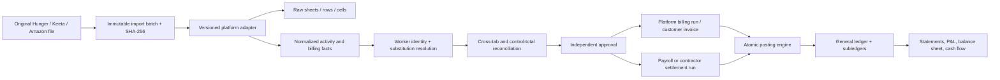

# Sol Ultra Target ERP Architecture

## Architecture principles

1. Posted journal lines are the financial source of truth.
2. Operational and imported facts never directly update financial balances.
3. Every posting has one legal entity, source document/version and idempotency key.
4. Posted documents/journals are immutable; correction is reversal plus replacement/adjustment.
5. No actor, entity, branch, platform, warehouse, currency, account, cost center or fiscal period fallback.
6. Maker, checker, poster, payer and reconciler are explicit and segregated.
7. Raw source evidence is content-addressed, versioned and reproducible.
8. Reports derive from posted facts and reconcile to subledgers/control accounts.

## Bounded contexts

| Context | Responsibilities |
|---|---|
| Identity & Access | Users, roles, permissions, legal-entity/branch scope, service principals, MFA, segregation policy and break-glass. |
| Organization | Tenant, legal entity, branch, department, warehouse, housing, cost center, project, fiscal calendar, tax registration and base currency. |
| Party & Workforce | Customers/platforms, suppliers, employees, contractor riders, contracts, bank details and effective-dated platform identities. |
| Integration Hub | Immutable source files, import batches, exact adapters, raw cells/facts, resolution, reconciliation, outbox/inbox and monitoring. |
| Delivery Operations | Shifts, attendance, orders, substitutions, vehicles, platform performance and operational exception facts. |
| Contract & Rating | Customer billing rate cards, rider employee/contractor payout policies, bonuses/penalties, effective dates and approved versions. |
| General Ledger | Accounts, journals, dimensions, periods, currencies, posting profiles, reversals, allocations, close and financial statements. |
| Sales & AR | Quotes/orders, platform billing runs, invoices/notes, receipts/allocations, customer advances, aging and statements. |
| Purchasing & AP | Requisition/RFQ/PO/receipt/invoice, three-way match, supplier advances/payments, landed cost and aging. |
| Inventory | Product/UOM, warehouses/bins, immutable movements, reservations/counts, valuation layers, COGS and reconciliation. |
| HR & Payroll | Contracts/components, attendance results, pay runs/payslips, loans/advances/deductions, GOSI/EOS/leave accrual and payments. |
| Expenses | Requests/claims/petty cash/advances, policy/receipts, allocations, reimbursements and posting. |
| Treasury | Bank/cash accounts, payment batches, statements, matching/reconciliation, transfers, fees, checks and forecasts. |
| Assets | Register, capitalization, books/schedules, depreciation, impairment, transfers and disposal. |
| Tax & E-Invoicing | Tax codes/rates, tax ledger/returns, invoice tax details, ZATCA generation/clearance/reporting/archive. |
| Reporting & Audit | Ledger/subledger statements, operational-financial reconciliation, dashboards, immutable audit and exception monitoring. |

## Organization and company semantics

- `Tenant` is the customer/account boundary if the product becomes SaaS.
- `LegalEntity` owns books, tax registrations, base currency, fiscal calendar and document sequences.
- `Branch` is an operating/tax/permission dimension beneath a legal entity.
- `PlatformAccount` is HungerStation, Keeta, Amazon or another customer/channel contract. It is not a legal entity.
- Current `Company` rows migrate to `PlatformAccount` (or a compatibility mapping) after data profiling.
- Workers may be employees or contractors; accounting treatment is contract-driven.

## Financial document and posting model

`FinancialDocument`

- identity, legal entity, branch, type, number, transaction/posting/due dates, currency/rate, source version and status;
- states: `Draft -> Submitted -> Approved -> Posted -> Reversed/Superseded`; cancellation before posting only;
- approval-policy snapshot, creator/submitter/approver/poster/reverser and reasons.

`PostingBatch` and `JournalEntry`

- posting batch is generated deterministically from document version and posting-profile version;
- unique `PostingKey = LegalEntity + DocumentType + DocumentId + Version + PostingEvent`;
- journal header and lines carry transaction/base currency, dimensions and source lineage;
- DB checks: exactly one positive debit/credit per line, totals balanced, valid open period and unique posting key;
- posted entries cannot update/delete; reversal points to original line/entry.

## Platform-to-finance data flow

Upload and normalization never post. Only approved AR/payroll documents post.

## Platform rating separation

- Customer billing policy and rider payout policy are different effective-dated rule sets.
- Hunger initial payout rule is an approved configuration, not parser code: 500 target, SAR 2,000 base, SAR 6 above, SAR 3 below; distance excluded from rider pay by default.
- Keeta validity is a blocking eligibility rule; source fees/distance/incentives are mapped independently.
- Amazon fixed/per-order/proration/incentive/OT behavior is contract configuration.
- Penalty facts do not become deductions until an approved policy and labor/legal validation permit it.

## Correct payroll posting

Example: gross pay SAR 2,000, allowance SAR 200, loan SAR 300, violation SAR 100, net SAR 1,800.

| Account | Debit | Credit |
|---|---:|---:|
| Wages/contractor expense | 2,000 | 0 |
| Allowance expense | 200 | 0 |
| Loan receivable | 0 | 300 |
| Violation/employee receivable | 0 | 100 |
| Net salary payable | 0 | 1,800 |

Payment later debits salary payable and credits bank/cash. Allocation records reduce the underlying loan/violation balances atomically and reverse with the payment/payroll reversal policy.

## Inventory costing architecture

- `InventoryTransaction` is immutable and references source document/version.
- quantity and valuation layers are separate; supported methods are configured per legal entity/item/warehouse.
- receipt, issue, transfer, return, adjustment and count create balanced quantity/value effects.
- negative availability is prevented with reservation/concurrency controls.
- inventory control accounts reconcile to valuation by legal entity/warehouse/item/category.

## Approval and permission engine

- policy inputs: document type, amount, legal entity, branch, platform, cost center, risk flags and requester role.
- ordered steps support users/roles, limits, quorum, delegation and expiry.
- self-approval/conflicting roles are rejected.
- approval records policy version, actual actor, comment, timestamp and evidence.
- backend permissions and object scope are mandatory; hiding UI is never authorization.

## Audit model

- append-only domain/audit events for create/change/submit/approve/post/reverse/export/login/configuration.
- old/new values, source document/version, actor/service principal, legal entity/branch, correlation/request/device/IP and reason.
- audit store write permission is separate from application update permission; periodic WORM/hash-chain export.

## Integration reliability

- inbox unique provider event/file fingerprint; outbox written in the same DB transaction as state change.
- workers use leases, exponential backoff, dead-letter queue and deterministic idempotency keys.
- every integration exposes reconciliation state and retry history.
- original files/XML/bank acknowledgments are private, hashed and retained by policy.

## Reporting architecture

- statutory statements query posted journal lines/account classifications.
- subledger reports query posted document allocations and reconcile to control accounts.
- operational dashboards query normalized facts but show reconciliation status.
- large reports use read-optimized projections/materialized views built from posted events, never independent balance mutations.

## Saudi tax architecture

- versioned tax codes determine rate, inclusive/exclusive calculation, recoverability, exemption/zero/out-of-scope/reverse charge and accounts.
- separate input/output VAT controls and tax-period locks/reconciliation.
- invoice aggregate includes required seller/buyer/branch details, sequence, UUID and immutable issue time.
- ZATCA adapter generates prescribed XML/PDF-A3 where applicable, QR/hash/stamp, onboarding credentials, clearance/reporting state, retries/rejections and archived request/response.
- implementation must be validated against current ZATCA guidance and licensed legal/accounting advice before any compliance claim.

## Migration strategy

1. Inventory current operational/company/platform identities and source histories.
2. Add organization/platform/identity mappings without removing legacy columns.
3. Import opening subledger balances with source evidence into a dedicated migration period.
4. Run dual-write only through controlled adapters, then shadow posting/reconciliation.
5. Reconcile two complete periods and obtain accountant sign-off.
6. Cut reports/payments to the new ledger; keep legacy read-only.
7. Remove compatibility paths only after retention and rollback windows expire.

Rollback is forward correction: disable new posting, reverse unclosed cutover batches and restore read routing. Posted history is never deleted.
